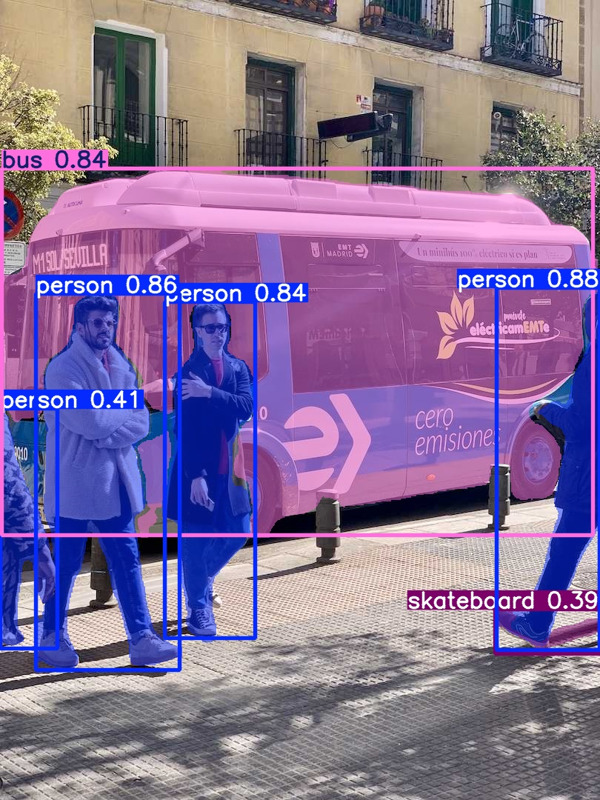

\# Modern Object Detection \& Segmentation

\### YOLOv8 vs Mask R-CNN — Architectural Comparison


\## Overview

This project explores modern computer vision approaches for \*\*object detection\*\* and \*\*instance segmentation\*\*, using pre-trained models to focus on \*\*architectural understanding rather than model training\*\*.


The work compares:

\- \*\*YOLOv8\*\* (single-stage detection and segmentation)

\- \*\*Mask R-CNN\*\* (two-stage instance segmentation)


The emphasis is on:

\- Output structures

\- Computational trade-offs

\- Memory and performance implications

\- Practical constraints on modest GPU hardware


---


\## Objectives

\- Run state-of-the-art detection and segmentation models on real images

\- Inspect and compare model outputs programmatically

\- Understand architectural differences between:

&nbsp; - Classification

&nbsp; - Detection

&nbsp; - Segmentation

\- Contrast \*\*single-stage\*\* vs \*\*two-stage\*\* segmentation pipelines


---


\## Models Used


\### YOLOv8 (Ultralytics)

\- Detection: bounding boxes, class labels, confidence scores

\- Segmentation: per-object pixel masks over the image grid

\- Single forward pass with Non-Max Suppression (NMS)


\### Mask R-CNN (Torchvision)

\- Two-stage pipeline:

&nbsp; 1. Region Proposal Network (RPN)

&nbsp; 2. RoI Align + classification, box regression, and mask heads

\- Predicts \*\*per-region masks\*\* rather than global image masks


---


\## Key Architectural Insights

\- \*\*Detection requires NMS\*\* because multiple overlapping boxes are predicted per object

\- \*\*Segmentation scales poorly with image resolution\*\* due to per-pixel masks

\- YOLO prioritises throughput and simplicity

\- Mask R-CNN prioritises structured reasoning and per-object processing

\- GPU memory constraints strongly influence model and input choices


---


\## Project Structure

```text

scripts/

&nbsp; inspect\_yolo.py

&nbsp; inspect\_seg.py

&nbsp; run\_mask\_rcnn\_cpu.py

data/

&nbsp; sample\_images/

docs/

outputs/ (ignored in git)

## Sample assets

- Sample input image: `images/source_image.jpg`
- Project overview deck: `docs/Object_Detection_Project_Overview.pptx`
- Slide generation script: `scripts/generate_presentation.py`

## Results

Example outputs generated using YOLOv8 for object detection and instance segmentation.

### Object detection


### Instance segmentation


### Notes
- Models used: YOLOv8 (detection and segmentation variants).
- Outputs are generated via Ultralytics default pipelines and saved from `runs/`.
- Images here are copied into `images/` to provide stable, versioned examples.

## Lessons learned

- **Outputs are easy, reproducibility is harder:** Pinning `torch/ultralytics/opencv` versions matters because small version changes can break inference or GPU compatibility.
- **Folder hygiene prevents repo rot:** Keeping `runs/`, `venv/`, and large artifacts out of git keeps the repo lightweight and reviewable.
- **Visual proof beats claims:** Including representative detection and segmentation examples makes results verifiable within seconds.
- **Segmentation adds compute cost:** Instance masks are heavier than bounding boxes, so batching and image sizing become more important for scale.

## Known limitations

- **Example-driven demo:** Current examples focus on a small number of images rather than a benchmark dataset with metrics (mAP/IoU), so results are qualitative.
- **No formal evaluation pipeline:** There is no automated scoring, threshold sweeping, or error analysis loop yet.
- **Hardware variability:** GPU vs CPU inference performance differs significantly, and CUDA-enabled Torch builds may not be portable across machines.

## Future enhancements

- Add a small evaluation script to compute basic metrics on a labelled sample set (mAP for detection, IoU for segmentation).
- Add configurable thresholds (confidence/IoU) and image resizing options via CLI args.
- Add a lightweight CI check (lint + import smoke test) to keep the repo healthy.
- Add a short “model selection” note explaining when to use detection vs segmentation.
For planned improvements, see: `docs/ROADMAP.md`.